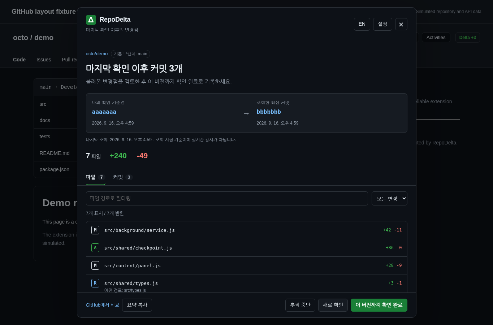

<div align="center">
  
  <h1>RepoDelta</h1>
  <p><strong>지난번에 읽던 곳부터.</strong></p>
  <p>마지막으로 직접 확인한 시점 이후, GitHub 기본 브랜치의 변경점을 확인합니다.</p>
  <p><a href="README.md">English</a> · <strong>한국어</strong></p>
</div>

RepoDelta 1.0.3은 GitHub 상단 배지, 페이지 내 변경점 패널, 로컬 확인 기준점 관리 화면으로 구성한 Chrome Manifest V3 확장프로그램입니다. 페이지를 열었다는 이유만으로 변경점을 읽은 것으로 처리하지 않습니다.

> 검증 범위: 구현과 자동화 테스트를 포함했습니다. 작업 환경의 관리 정책이 확장 직접 설치와 브라우저 URL 탐색을 차단하므로, 브라우저 검증과 화면 캡처는 실제 앱 소스를 사용하는 오프라인 Chromium 하네스에서 GitHub 및 Chrome API를 모의 처리했습니다. 네이티브 MV3 설치, 실제 GitHub 연동, 스토어 승인은 검증하지 않았습니다. [QA 보고서](docs/QA-KR.md)를 확인하세요.

## 바로 설치하기

1. `RepoDelta-v1.0.3-chrome.zip`을 계속 보관할 로컬 폴더에 압축 해제합니다. 해당 폴더 바로 아래에 `manifest.json`이 있습니다.
2. `chrome://extensions`에서 **개발자 모드**를 켜고 **압축해제된 확장 프로그램을 로드합니다**를 선택합니다. 방금 압축 해제한 폴더를 지정합니다. 소스 패키지로 설치한다면 그 안의 **dist/** 폴더를 선택합니다.
3. 열려 있던 GitHub 저장소 페이지를 새로고침합니다. **Delta → 이 버전부터 추적**으로 화면에 표시된 기본 브랜치의 SHA를 저장합니다.
4. 나중에 다시 방문해 커밋과 변경 파일을 검토하고, **이 버전까지 확인 완료**를 누른 뒤 확인합니다.

미리 빌드한 확장의 설치에는 Node.js가 필요하지 않습니다. 공개 저장소는 비인증 API 한도 내에서 토큰 없이 사용할 수 있습니다. GitHub 웹사이트의 로그인 상태를 API 인증에 재사용하지 않습니다.

## 구현 기능

- 직접 지정한 확인 기준점, 고정된 두 SHA 사이의 비교, 마지막 조회 시각 표시.
- 추적 중인 저장소의 재방문 시 선택적 자동 확인. 미등록 저장소는 패널을 열기 전 API 요청 없음.
- 파일 추가·수정·삭제·이름 변경 상태, 줄 수 변화, 경로·상태 필터, 이전 파일명 표시, 버전에 고정된 파일 링크. 삭제된 파일은 이전 기준점에서 열기.
- 오래된 순서의 커밋 목록. 요청당 100개, 사용자가 더 보기를 눌러 최대 500개 조회. 파일 300개가 반환되면 전체가 아닐 수 있음을 안내.
- 기본 브랜치 변경, 저장소 ID 변경, 강제 푸시·리베이스·되돌리기 등 이력 변경, 비교 결과를 조회할 수 없는 상황을 구분.
- 오래된 탭이 최신 기준점을 덮어쓰지 못하도록 revision 검증. 확인 완료 시 새 HEAD가 아닌 이미 화면에 표시한 SHA만 저장.
- EN 기본 / KR 전환, GitHub 테마 연동, Shadow DOM, 네이티브 모달, 키보드 탭 이동, Escape 닫기, 포커스 복원.
- 설정 화면에서 추적 목록·검색·삭제·JSON 내보내기·병합 가져오기·캐시 삭제·세션 토큰 관리.
- 선택적 fine-grained PAT. 선택한 저장소의 **Contents 읽기 전용** 권한을 우선 사용. 토큰을 local/sync 저장소나 백업에 넣지 않음.
- 별도 백엔드, 분석 수집, 광고, AI 서비스, 원격 코드, 런타임 의존성, GitHub 쓰기 API 없음.



*실제 RepoDelta UI를 캡처했으며 저장소와 API 응답은 모의 데이터입니다. 실제 GitHub 통합 검증 화면은 아닙니다.*

## 1.0.3의 범위와 한계

다른 브랜치를 보고 있더라도 **기본 브랜치만 추적**합니다. 기준점은 버전 전체에 적용되며, 필터는 파일별 읽음 상태를 만들지 않습니다. 설치 이전의 방문 이력 복원, 정기 폴링, 알림, 릴리스·이슈 분석, 전체 인라인 diff 뷰어는 없습니다. 상세 코드 변경은 GitHub에서 확인합니다.

API 응답은 5분간 캐시합니다. **새로 확인**은 GitHub의 재시도 제한이 없으면 즉시 재검증합니다. API 할당량은 같은 IP 또는 토큰을 사용하는 다른 도구와 공유됩니다. 저장소 이름이 바뀌면 현재 정식 주소로 다시 방문하여 새 경로의 기준점을 등록해야 할 수 있습니다. 추적 키는 대소문자를 구분하지 않는 `owner/repo`이며, 고유 저장소 ID로 같은 이름의 다른 저장소를 구분합니다.

토큰과 API·조회 캐시는 Chrome 재시작 또는 확장 재로드·업데이트 시 삭제됩니다. 기준점과 환경 설정은 `chrome.storage.local`에 남으며 직접 삭제하거나 확장을 제거할 때 사라집니다. 백업에는 비공개 저장소 이름 등 민감할 수 있는 정보가 있습니다. 암호화된 비밀 저장소는 아닙니다.

## 빌드와 테스트

**Node.js 22 이상**만 필요합니다. npm 의존성이 없어 별도의 패키지 설치나 번들러는 필요하지 않습니다.

```sh
npm run check
npm test
npm run build
npm run package
```

`npm run package`는 JavaScript·JSON 검사, Node 테스트, `dist/` 빌드 후 `releases/RepoDelta-v1.0.3-chrome.zip`을 만듭니다. 확장 ZIP 최상위에 `manifest.json`이 있으며 QA 데이터, 테스트, 소스용 문서는 제외됩니다. 빌드 스크립트는 Unix 전용 명령에 의존하지 않습니다.

```text
src/
  shared/       검증 함수, 번역, DOM 유틸리티
  background/   읽기 전용 API, 저장소, 서비스, 메시지 권한 검증
  content/      배지, 페이지 이동 대응, 변경점 패널
  options/      설정 및 기준점 관리
  popup/        도구 모음 팝업
public/         매니페스트, 아이콘, 사용 안내, 개인정보 처리방침
scripts/        의존성 없는 빌드, 테스트, ZIP 패키징, QA 서버
qa/             GitHub·Chrome 모의 환경. 설치 패키지에는 미포함
tests/         Node 회귀 테스트와 선택적 브라우저 테스트 실행기
```

정책 제한이 없는 개발 브라우저에서는 `npm run serve:qa` 실행 후 `http://127.0.0.1:5198/qa/index.html`에서 동작을 살펴볼 수 있습니다. 이 화면은 **시뮬레이션**이며 설치된 확장이 아닙니다. [QA 문서](docs/QA-KR.md)에 실제 설치 후 확인해야 할 항목을 정리했습니다.

## 문서

[아키텍처](docs/ARCHITECTURE-KR.md) · [QA 및 미완료 검증](docs/QA-KR.md) · [스토어 소개문·배포 체크리스트](docs/STORE-LISTING-KR.md) · [변경 내역](CHANGELOG-KR.md) · [개인정보 처리방침](public/privacy-policy.html) · [사용 안내](public/help.html)

이 패키지는 스토어에 자동 배포하지 않습니다. 제출 전 `public/privacy-policy.html`을 실제 공개 URL에 호스팅해야 합니다. GitHub 저장소나 스토어 주소도 자동 생성하지 않습니다.

## 라이선스

[MIT](LICENSE). GitHub 또는 Google의 공식 제품이 아니며 해당 회사들의 보증을 받지 않습니다.
