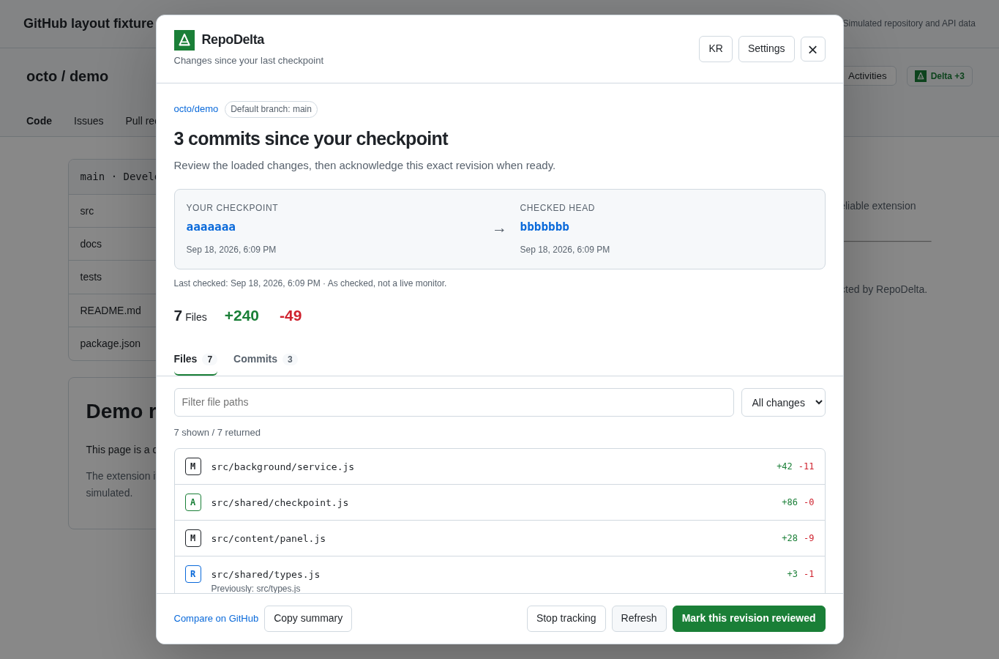

<div align="center">
  
  <h1>RepoDelta</h1>
  <p><strong>Pick up where you left off.</strong></p>
  <p>See what changed on a GitHub repository's default branch since your last explicit checkpoint.</p>
  <p><strong>English</strong> · <a href="README-KR.md">한국어</a></p>
</div>

## Branding update in 1.0.4

All active icon surfaces now use the publisher's new logo: installation PNGs, the GitHub badge/panel, settings/popup, help/privacy headers and favicons. SVG geometry is unchanged. The API/token/checkpoint implementation is unchanged. [Icon pipeline](docs/BRANDING.md) · [Current verification](docs/QA.md).


RepoDelta 1.0.4 is a Chrome Manifest V3 extension with a small GitHub header badge, an in-page change panel, and a local checkpoint manager. It does not mark anything reviewed just because you opened a page.

> Delivery status: implementation and automated tests are included. Native unpacked extension installation is not certified in this environment. Browser screenshots/tests use the actual application source in an offline Chromium harness with simulated GitHub and Chrome APIs. Native MV3 installation, live GitHub integration, and store approval are not certified. See [QA report](docs/QA.md).

## Use it

1. Extract `RepoDelta-v1.0.4-chrome.zip` to a permanent local folder. Its root contains `manifest.json`.
2. Open `chrome://extensions`, enable **Developer mode**, select **Load unpacked**, and choose that folder. When using the source package, choose its **dist/** directory instead.
3. Reload an open GitHub repository. Select **Delta**, then **Start tracking here** to save the displayed default-branch SHA.
4. On a later visit, check the new commits and changed files. Choose **Mark this revision reviewed** and confirm when you are done.

No Node.js installation is needed to load the prebuilt extension. No GitHub sign-in through RepoDelta is required for public repositories within the anonymous API quota. The web page being signed in does not supply a REST API token.

## What is implemented

- Explicit checkpoints, immutable SHA-to-SHA comparisons, and a displayed check timestamp.
- An optional automatic check when revisiting an already tracked repository. No request for an untracked repository until its panel is opened.
- File status, additions/deletions, path and status filters, rename history, and version-pinned file links. Deleted files open at the saved checkpoint.
- Chronological commit pages, 100 per request, manually loaded up to 500. GitHub's 300-file comparison limit is conservatively flagged as possibly incomplete.
- Explicit warnings for default-branch changes, replaced repository IDs, rewritten or rewound history, and unavailable comparisons.
- Optimistic checkpoint revisions prevent an old tab from overwriting a newer checkpoint. Marking reviewed saves the SHA already shown, never a newly fetched HEAD.
- EN/KR UI; GitHub theme tokens; Shadow DOM; a native modal dialog, keyboard tabs, Escape to close, and focus restoration.
- Options page: tracked-repository list, search, removal, JSON backup/merge import, cache clearing, and session-only token management.
- Optional fine-grained PAT, preferably **Contents: read-only** on selected repositories. Tokens never enter local/sync storage or exports.
- No backend, analytics, ads, AI service, remote code, runtime dependencies, or GitHub write API calls.



*Screenshot: actual RepoDelta UI, simulated repository and API data. It is not a live GitHub verification.*

## Scope and important limits

**Only the default branch is tracked in 1.0.4**, including when you browse another branch. A checkpoint covers the entire revision; filters do not create per-file read states. There is no pre-install browsing-history recovery, scheduled polling, desktop notification, release/issue analysis, or full inline patch viewer. Source changes open on GitHub.

A five-minute API cache reduces repeated requests; **Refresh** revalidates immediately unless GitHub has imposed a cooldown. API quotas are shared with other clients using the same IP/token. A repository rename may require reopening the canonical URL and registering a checkpoint at the new path. Tracking keys are case-insensitive `owner/repo`, with a repository ID guard against replacement.

Session tokens and response/snapshot caches disappear when Chrome restarts or the extension reloads/updates. Checkpoints and preferences remain in `chrome.storage.local` until removed, cleared, or the extension is uninstalled. Backups contain potentially sensitive private repository names. Storage is not an encrypted vault.

## Build and test

Requires **Node.js 22+** only. The project has no npm dependencies; no dependency installation or bundler is needed.

```sh
npm run check
npm test
npm run build
npm run package
```

`npm run package` validates JavaScript/JSON, runs the Node tests, builds `dist/`, and writes `releases/RepoDelta-v1.0.4-chrome.zip`. The Chrome ZIP has `manifest.json` at its root; it excludes QA fixtures, tests, and source-only documentation. Build scripts work without Unix shell utilities.

```text
src/
  shared/       Pure validation, translations, DOM utilities
  background/   Read-only API client, storage, service, message boundary
  content/      Header badge, navigation handling, change panel
  options/      Settings and checkpoint manager
  popup/        Toolbar popup
public/         Manifest, icons, help, privacy, locale descriptions
scripts/        Dependency-free build, test, ZIP packaging, local QA server
qa/             Simulated GitHub/Chrome adapter; never included in dist
tests/         Node regression tests and optional browser harness runner
```

For interactive fixture testing, run `npm run serve:qa` and open `http://127.0.0.1:5198/qa/index.html` in an unrestricted development browser. This is a **simulation**, not an installed extension. [QA](docs/QA.md) documents both the offline renderer and remaining native checks.

## Documentation

[Architecture](docs/ARCHITECTURE.md) · [QA and remaining checks](docs/QA.md) · [Store listing and release checklist](docs/STORE-LISTING.md) · [Changelog](CHANGELOG.md) · [Privacy policy](public/privacy-policy.html) · [User guide](public/help.html)

The extension is not published by this package. Host `public/privacy-policy.html` at a real public URL before submitting to Chrome Web Store. No store URL or GitHub repository is created automatically.

## License

[MIT](LICENSE). Not affiliated with or endorsed by GitHub or Google.
